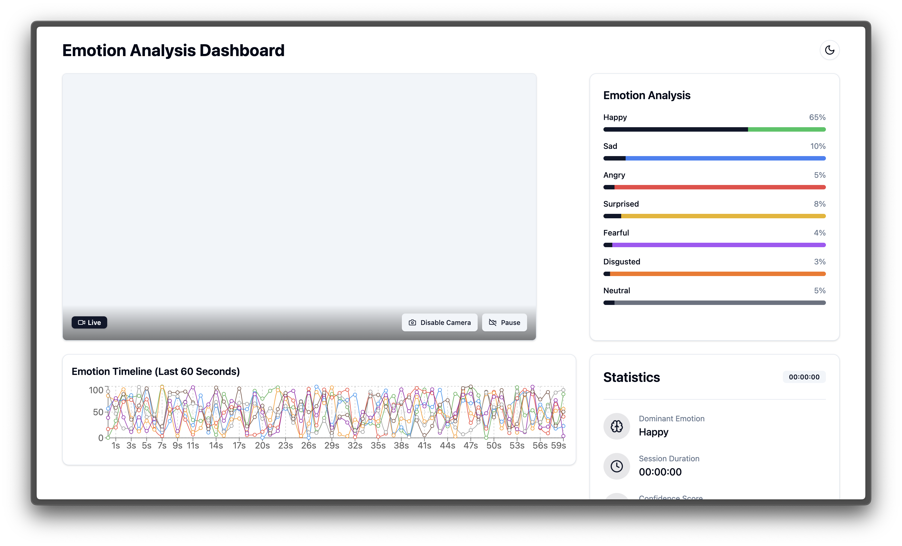

# Emotion Analysis Dashboard

A real-time emotion analysis dashboard that uses OpenAI's vision models to detect and visualize emotions from webcam feed. Built with React, TypeScript, and Tailwind CSS.



## Features

- 🎥 Real-time webcam emotion analysis
- 📊 Live emotion visualization with charts
- 📈 Emotion timeline tracking
- 🌓 Dark/Light mode support
- 🔐 Secure API key management
- 🎨 Beautiful UI with Tailwind CSS
- 📱 Responsive design
- 🔄 Mirrored video feed for natural interaction

## Tech Stack

- React + TypeScript
- Vite
- Tailwind CSS
- Shadcn/ui
- OpenAI Vision API
- Framer Motion
- Recharts

## Getting Started

### Prerequisites

- Node.js 16+
- OpenAI API key with vision model access

### Installation

1. Clone the repository:
```bash
git clone https://github.com/mousberg/emotion-analysis-dashboard.git
cd emotion-analysis-dashboard
```

2. Install dependencies:
```bash
npm install
```

3. Start the development server:
```bash
npm run dev
```

4. Open http://localhost:5173 in your browser

### Usage

1. When you first open the app, you'll be prompted to enter your OpenAI API key
2. The key is stored locally in your browser and never sent to any server
3. Grant camera permissions when prompted
4. The dashboard will start analyzing emotions in real-time
5. Use the controls to:
   - Toggle camera
   - Pause/resume analysis
   - Switch between dark/light mode
   - Change API key

## Components

- **VideoFeed**: Handles webcam input and emotion detection
- **EmotionBarChart**: Displays current emotion percentages
- **EmotionTimeline**: Shows emotion changes over time
- **StatisticsPanel**: Displays session statistics
- **ApiKeyDialog**: Manages OpenAI API key input

## Contributing

1. Fork the repository
2. Create your feature branch (`git checkout -b feature/AmazingFeature`)
3. Commit your changes (`git commit -m 'Add some AmazingFeature'`)
4. Push to the branch (`git push origin feature/AmazingFeature`)
5. Open a Pull Request

## License

This project is licensed under the MIT License - see the [LICENSE](LICENSE) file for details.

## Acknowledgments

- Built with [shadcn/ui](https://ui.shadcn.com/) components
- Uses OpenAI's GPT-4 Vision models
- Inspired by modern dashboard designs

## Privacy Notice

This application:
- Only processes video data locally
- Never stores or transmits video data
- Stores API keys only in your browser's localStorage
- Makes API calls directly from your browser to OpenAI

## Support

For support, please open an issue in the GitHub repository.
